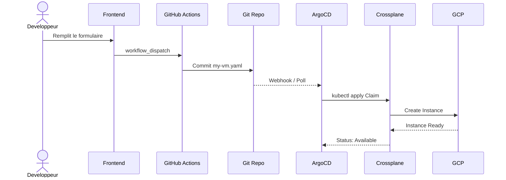
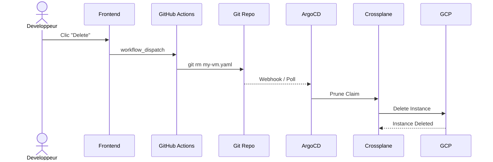

# Platform Engineering

Self-service infrastructure sur **GCP** avec Kubernetes, Crossplane et GitOps

<div class="abs-br m-6 text-sm opacity-50">
Romain Capelle — Veille technologique 2026
</div>

---
layout: two-cols
layoutClass: gap-8
---

# Le probleme

<v-clicks>

- Les devs **attendent les Ops** pour avoir une VM
- Tickets, process manuels, delais
- Pas de standardisation des environnements
- Zero visibilite sur ce qui tourne
- Cout non maitrise

</v-clicks>

::right::

# La solution

<v-clicks>

- **Self-service** via un portail web
- **GitOps** : infra versionnee dans Git
- **API Kubernetes** comme interface unique
- **Reconciliation** continue (drift auto-corrige)
- **Abstraction** de la complexite cloud

</v-clicks>

---
layout: center
---

# Architecture


<div class="text-center text-sm mt-4 opacity-60">
6 etapes — Du clic bouton a la VM running sur GCP
</div>

---

# Stack technique

| Composant | Role | Pourquoi ce choix |
|-----------|------|-------------------|
| **Kind** | Cluster K8s local | Leger, parfait pour un POC |
| **Crossplane** | Control plane cloud | Gestion des ressources GCP via l'API K8s |
| **ArgoCD** | GitOps operator | Sync auto entre Git et le cluster |
| **GitHub Actions** | CI/CD | Generation des manifests Crossplane |
| **GCP Compute** | Cloud cible | VMs Compute Engine |
| **HTML/JS** | Frontend | Portail developpeur simple |

<v-click>

> **Principe cle** : Kubernetes comme **plan de controle universel**, pas seulement pour des containers.

</v-click>

---

# Crossplane — Le concept

<div class="grid grid-cols-2 gap-8">

<div>

### Sans Crossplane
```
Dev → Ticket Ops → Console GCP → Clic clic
        → Terraform → PR → Review → Apply
```

**Probleme** : processus lent, non standardise

</div>

<div>

### Avec Crossplane
```yaml
apiVersion: compute.platform.local/v1alpha1
kind: VirtualMachine
metadata:
  name: my-server
spec:
  parameters:
    vmName: my-server
    machineType: e2-small
```

**kubectl apply** et c'est tout.

</div>

</div>

---

# Crossplane — Comment ca marche

<div class="grid grid-cols-3 gap-6 mt-4">

<div class="border rounded-lg p-4 text-center">

### XRD
**CompositeResourceDefinition**

Definit l'API custom `VirtualMachine` avec ses parametres

*= le schema*

</div>

<div class="border rounded-lg p-4 text-center">

### Composition
**Pipeline**

Mappe les parametres vers les ressources GCP reelles (Instance, Disk, Address)

*= l'implementation*

</div>

<div class="border rounded-lg p-4 text-center">

### Claim
**VirtualMachine**

La demande utilisateur, namespace-scoped, versionnee dans Git

*= l'intention*

</div>

</div>

<v-click>

```
XRD (schema) + Composition (mapping) = API custom
Claim (intention) → Crossplane reconcile → Ressource GCP creee
```

</v-click>

---

# L'API VirtualMachine

```yaml {all|3-4|8|9|10|11-13}
apiVersion: compute.platform.local/v1alpha1
kind: VirtualMachine
metadata:
  name: my-dev-server
spec:
  parameters:
    vmName: my-dev-server
    machineType: e2-small          # e2-micro par defaut
    zone: europe-west1-b
    diskSizeGb: 30                 # 20 par defaut
    spot: true                     # VM preemptible
    staticIp: true                 # IP externe statique
    dataDiskSizeGb: 100            # Disque data supplementaire
```

<v-click>

| Parametre | Defaut | Description |
|-----------|--------|-------------|
| `vmName` | *requis* | Nom de l'instance |
| `machineType` | `e2-micro` | Type de machine GCP |
| `spot` | `false` | VM preemptible (moins cher) |
| `staticIp` | `false` | IP externe fixe |
| `dataDiskSizeGb` | `0` | Disque data (0 = aucun) |

</v-click>

---

# GitOps Flow — Creation



---

# GitOps Flow — Suppression



<v-click>

> La suppression du fichier YAML dans Git **declenche la destruction** de la VM sur GCP. Git = source de verite.

</v-click>

---
layout: two-cols
layoutClass: gap-8
---

# Frontend

Portail developpeur **HTML/CSS/JS** vanilla

<v-clicks>

- Dark theme moderne
- Formulaire de creation VM
- Choix du type, zone, disque
- Options Spot / IP statique
- Suppression en un clic
- Statut des workflow runs

</v-clicks>

::right::

<div class="border rounded-lg overflow-hidden mt-2">

```
┌──────────────────────────┐
│  Platform Engineering    │
├──────────────────────────┤
│  Create VM               │
│  ┌──────┐ ┌───────────┐ │
│  │ Name │ │ e2-micro ▼│ │
│  └──────┘ └───────────┘ │
│  ┌──────────┐ ┌───────┐ │
│  │ Zone   ▼ │ │ 20 GB │ │
│  └──────────┘ └───────┘ │
│  ☐ Spot VM  ☐ Static IP │
│  [   Create VM   ]      │
├──────────────────────────┤
│  Active VMs              │
│  ┌──────────────────┐   │
│  │ my-server         │   │
│  │ e2-small · ew1-b  │   │
│  └──────────────────┘   │
└──────────────────────────┘
```

</div>

---

# GitHub Actions

Deux workflows `workflow_dispatch` :

<div class="grid grid-cols-2 gap-6 mt-4">

<div>

### create-vm.yml

```yaml
inputs:
  vm_name: string     # requis
  machine_type: choice
  zone: choice
  disk_size_gb: number
  spot: boolean
  static_ip: boolean
  data_disk_size_gb: number
```

1. Valide le nom
2. Genere le Claim YAML
3. Commit + push

</div>

<div>

### delete-vm.yml

```yaml
inputs:
  vm_name: string     # requis
```

1. Verifie que le claim existe
2. `git rm` le fichier
3. Commit + push

ArgoCD prune automatiquement.

</div>

</div>

---

# Demo live

<div class="grid grid-cols-2 gap-8 mt-8">

<div class="text-center">

### 1. Creer une VM

Portail → Formulaire → Create

*Workflow GitHub Actions se lance*

</div>

<div class="text-center">

### 2. Observer le GitOps

Git → ArgoCD sync → Crossplane reconcile

*VM apparait sur GCP*

</div>

</div>

<div class="grid grid-cols-2 gap-8 mt-8">

<div class="text-center">

### 3. Verifier sur GCP

Console GCP → Compute Engine

*Instance running*

</div>

<div class="text-center">

### 4. Supprimer

Portail → Delete → Confirm

*VM detruite, fichier supprime de Git*

</div>

</div>

---

# Structure du projet

```
platform-project/
├── .github/workflows/
│   ├── create-vm.yml              # Workflow creation
│   └── delete-vm.yml              # Workflow suppression
├── crossplane/
│   ├── provider/
│   │   ├── provider-gcp-compute.yaml
│   │   ├── provider-config.yaml
│   │   └── function-patch-and-transform.yaml
│   ├── compositions/
│   │   ├── xrd-vm.yaml            # API custom (XRD)
│   │   └── composition-vm.yaml    # Mapping → GCP
│   └── claims/                    # GitOps directory
├── argocd/
│   └── application-claims.yaml
├── frontend/
│   └── index.html                 # Developer portal
├── scripts/
│   └── setup.sh                   # Setup complet
└── slides/
    └── slides.md                  # Cette presentation
```

---

# Enseignements

<v-clicks>

### Ce qui marche bien
- **Crossplane Pipeline mode** (function-patch-and-transform) — plus flexible que l'ancien P&T
- **ArgoCD prune** — supprimer un fichier = detruire la ressource cloud
- **workflow_dispatch** — API simple pour trigger depuis n'importe quel frontend

### Points d'attention
- **Crossplane v2 migration** — les XRD v1 sont deprecated
- **ADC credentials** — expirent apres quelques heures (OK pour POC, pas pour prod)
- **Rate limiting GitHub API** — le frontend appelle directement l'API (pas de backend proxy)

### Pour aller plus loin
- Ajouter d'autres ressources : Cloud SQL, GCS Bucket, GKE
- Backstage comme portail (remplace le frontend vanilla)
- Workload Identity Federation (remplace les ADC)
- Policy engine (OPA/Kyverno) pour valider les claims

</v-clicks>

---
layout: center
class: text-center
---

# Merci

**Platform Engineering — GCP via Crossplane**

[GitHub](https://github.com/Shinr0/platform-project) · [Documentation](https://shinr0.github.io/platform-project/)

<div class="text-sm opacity-50 mt-4">
Romain Capelle — 2026
</div>
